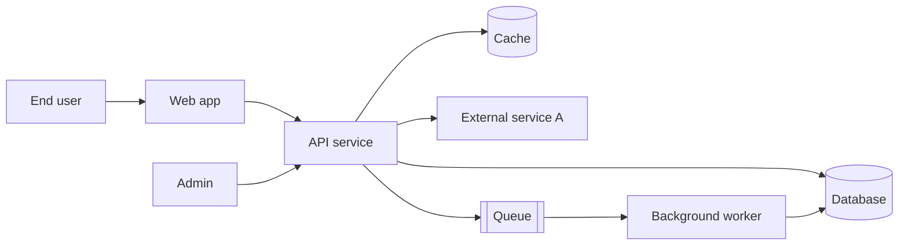
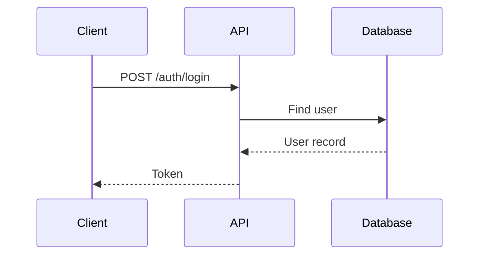

# Architecture

Owner: [Name]. Last reviewed: [YYYY-MM-DD]. Review every quarter.

## 1. Purpose and Scope

This document explains how [Project Name] is built and why. It is for developers, testers, and operators. For setup steps see [SETUP.md](SETUP.md). For decisions and their reasons see [adr/](adr/).

## 2. System Context

Who and what talks to the system.



> Guide: Replace this diagram with your real one. Keep it to 10 boxes or fewer. Save the source in this repo so it can be edited.

## 3. Main Components

| Component | Job | Tech | Owner | Scales how |
|---|---|---|---|---|
| [Web app] | User interface | [React] | [Team] | Static hosting, CDN |
| [API service] | Business logic and endpoints | [FastAPI] | [Team] | More instances behind a load balancer |
| [Worker] | Slow or scheduled jobs | [Celery] | [Team] | More workers per queue |
| [Database] | Main data store | [PostgreSQL] | [Team] | Vertical, then read replicas |
| [Cache] | Speed up reads, short lived data | [Redis] | [Team] | Cluster |

## 4. Core Flows

Describe each flow as numbered steps. Include 3 to 5 flows that matter most.

### 4.1 [Flow name, for example "User signs in"]

1. [Client sends credentials to `POST /auth/login`.]
2. [API checks the user in the database.]
3. [API returns an access token that expires in 60 minutes.]



### 4.2 [Flow name]

[Steps.]

### 4.3 [Flow name]

[Steps.]

## 5. Folder Structure

```text
[repo name]/
├── src/
│   ├── api/          [route handlers, request and response models]
│   ├── services/     [business logic, no web code]
│   ├── models/       [database models]
│   ├── repositories/ [database queries]
│   ├── workers/      [background jobs]
│   ├── core/         [config, logging, security, shared helpers]
│   └── main.py       [app entry point]
├── tests/
│   ├── unit/
│   ├── integration/
│   └── e2e/
├── migrations/       [database changes, one file per change]
├── infra/            [Docker, deploy, cloud configuration]
├── scripts/          [helper scripts for developers]
├── docs/             [documentation]
└── .github/          [templates and CI workflows]
```

| Folder | Holds | Rule |
|---|---|---|
| `src/api` | HTTP layer only | No business logic here |
| `src/services` | Business rules | Does not import from `api` |
| `src/repositories` | Database access | Only place that writes queries |
| `migrations` | Schema changes | Never edit after merge |

> Guide: Explain every top level folder. If a new person cannot tell where a change belongs, this table needs work.

## 6. Technology Choices

| Choice | What we picked | Why (short) | Decision record |
|---|---|---|---|
| Database | [PostgreSQL] | [Relational data, strong consistency] | [adr/0001-choose-database.md](adr/0001-choose-database.md) |
| [Framework] | [Name] | [Reason] | [ADR link] |
| [Queue] | [Name] | [Reason] | [ADR link] |

## 7. Data Model Summary

[5 to 10 lines on the main entities and how they relate.] Full schema: [DATABASE.md](DATABASE.md).

## 8. External Integrations

| Service | Purpose | Auth method | If it is down | Timeout and retries | Owner |
|---|---|---|---|---|---|
| [Payment provider] | Take payments | API key | Queue orders, retry for 24 hours | 10 s, 3 tries | [Name] |
| [Email provider] | Send email | API key | Queue and retry | 5 s, 5 tries | [Name] |
| [Identity provider] | Single sign on | OAuth 2.0 | Only existing sessions work | 5 s, 2 tries | [Name] |

## 9. Cross Cutting Concerns

| Topic | How we handle it |
|---|---|
| Authentication | [Method, token lifetime] |
| Authorization | [Roles and permissions model] |
| Configuration | Environment variables. See [ENVIRONMENT.md](ENVIRONMENT.md). |
| Logging | [JSON logs, fields: time, level, request_id, user_id] |
| Errors | [Standard error format. See [API.md](API.md)] |
| Caching | [What is cached, for how long, how it is cleared] |
| Background jobs | [Retry rules, dead letter handling] |
| Feature flags | [Tool or method] |
| Secrets | [Where stored, how rotated] |

## 10. Quality Targets

| Target | Value | How measured |
|---|---|---|
| Availability | 99.9% (about 43 minutes of downtime per 30 days) | Uptime monitor |
| API response time | p95 under 300 ms, p99 under 800 ms | Metrics dashboard |
| Error rate | Under 0.5% of requests | Metrics dashboard |
| Peak load | [N] requests per second | Load test |
| Data size | [N GB now, N GB in 12 months] | Database metrics |
| Recovery | See [DISASTER_RECOVERY.md](DISASTER_RECOVERY.md) | Restore drills |

## 11. Known Limits

* [Maximum upload size: N MB]
* [Maximum records per page: N]
* [Single region deployment: a region outage means downtime]
* [Any part that cannot scale beyond N]

## 12. Security Model

[Trust boundaries, what is public, what needs login, how sensitive data is stored.] Reporting rules: [../SECURITY.md](../SECURITY.md).

## 13. Deployment View

[Where each component runs.] Steps and environments: [DEPLOYMENT.md](DEPLOYMENT.md).

## 14. Risks and Technical Debt

| Item | Risk | Plan | Owner | Target date |
|---|---|---|---|---|
| [Item] | [What can go wrong] | [Fix] | [Name] | [Date] |

## 15. Change History

| Date | Change | Author |
|---|---|---|
| [YYYY-MM-DD] | First version | [Name] |
