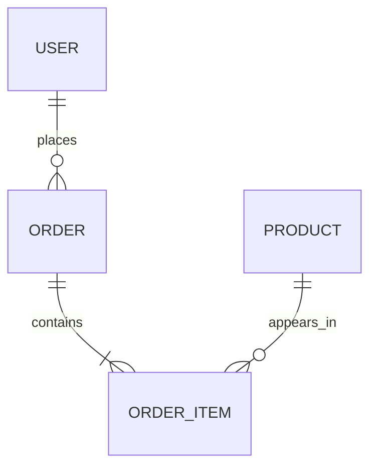

# Database Guide

Owner: [Name]. Last reviewed: [YYYY-MM-DD].

## 1. Engines and Versions

| Environment | Engine | Version | Host | Notes |
|---|---|---|---|---|
| Local | [PostgreSQL] | [16] | Docker | Seed data loaded |
| Test (CI) | [PostgreSQL] | [16] | CI service container | Empty at start |
| Staging | [PostgreSQL] | [16] | [Managed service] | Copy of production shape, no real personal data |
| Production | [PostgreSQL] | [16] | [Managed service] | Daily backups. See [DISASTER_RECOVERY.md](DISASTER_RECOVERY.md) |

## 2. Schema Overview



> Guide: Replace with your real model. Keep the diagram source in the repo. Regenerate it when the schema changes.

## 3. Naming Rules

| Item | Rule | Example |
|---|---|---|
| Tables or collections | [plural, snake_case] | `order_items` |
| Columns or fields | [snake_case] | `created_at` |
| Primary key | `id` | `id` |
| Foreign key | `[singular table]_id` | `user_id` |
| Booleans | Start with `is_` or `has_` | `is_active` |
| Timestamps | `created_at`, `updated_at`, in UTC | N/A |
| Indexes | `idx_[table]_[columns]` | `idx_orders_user_id` |
| Unique constraints | `uq_[table]_[columns]` | `uq_users_email` |

## 4. Table Reference

> Guide: One block per table. Mark columns that hold personal or sensitive data.

### 4.1 `[table_name]`

* Purpose: [one sentence]
* Owner module: [src path]
* Expected size: [rows now, rows in 12 months]
* Retention: [keep forever | delete after N days]

| Column | Type | Null | Default | Index | Sensitive | Notes |
|---|---|---|---|---|---|---|
| `id` | uuid | No | generated | Primary | No | [text] |
| `[email]` | text | No | none | Unique | Yes (personal) | [Lowercase on save] |
| `created_at` | timestamp | No | now | Yes | No | UTC |
| `updated_at` | timestamp | No | now | No | No | UTC |

**Relations:** [belongs to `[table]` through `[column]`]
**Rules:** [for example "status can only move from draft to active to closed"]

### 4.2 `[next_table]`

[Repeat.]

## 5. Indexes

| Index | Table | Columns | Why | Added in |
|---|---|---|---|---|
| `idx_[table]_[cols]` | `[table]` | `[cols]` | [Query that needs it] | [migration id] |

Rules: add an index only for a real query. Check the query plan. Remove indexes that are unused for 90 days.

## 6. Migrations

* Tool: [Alembic | Flyway | Prisma Migrate | Knex | other]
* Location: `[migrations/]`

**Create:** `[command]`
**Apply:** `[command]`
**Roll back one step:** `[command]`
**Check status:** `[command]`

**Rules**
1. One change per migration. Name it clearly: `[0042_add_orders_status]`.
2. Never edit a migration after it is merged. Add a new one.
3. Every migration must be reversible, or the pull request must explain why not.
4. Make changes safe for old code (expand, then contract):
   1. Add the new column, nullable.
   2. Deploy code that writes to both.
   3. Fill old rows in batches.
   4. Deploy code that reads the new column.
   5. Remove the old column in a later release.
5. Test on a copy of production sized data for any change on a table over [1 million] rows.
6. Never take a long table lock in production. Avoid changes that rewrite a large table during business hours.
7. A migration that deletes data needs 2 approvals and a fresh backup.

## 7. Seed and Test Data

* Seed command: `[command]`
* What it creates: [list]
* Never load production data into local or staging unless it is anonymized.

## 8. Backups and Recovery

Summary: [daily full backup, point in time recovery for 7 days, kept for 30 days]. Full plan: [DISASTER_RECOVERY.md](DISASTER_RECOVERY.md).

## 9. Data Protection

| Data type | Where stored | Protection | Who can read |
|---|---|---|---|
| Passwords | `[table.column]` | Salted hash ([algorithm]), never plain text | Nobody |
| Personal data | [tables] | Encrypted at rest, access logged | [roles] |
| Payment data | Not stored here | Held by [provider] | N/A |

See [PRIVACY.md](PRIVACY.md).

## 10. Access and Roles

| Role | Used by | Permissions |
|---|---|---|
| `app_user` | The application | Read and write on app tables |
| `migration_user` | Deploy pipeline | Schema changes |
| `readonly_user` | Analysts and support | Read only, on approved views |

Developers have no direct write access to production. Access is requested through [process] and expires after [N days].

## 11. Performance Rules

* Every list query has a limit.
* Avoid queries inside loops (N plus 1). Fetch in one query or in batches.
* Slow query threshold: [200 ms]. Slow queries are logged and reviewed every [week].
* Use read replicas only for reports that can be [N seconds] behind.

## 12. Useful Queries

```sql
-- [Describe what it does]
[query]
```
