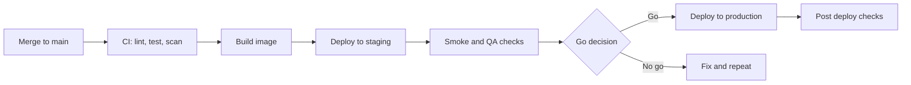

# Deployment Guide

Owner: [Platform or DevOps lead]. Last reviewed: [YYYY-MM-DD].

## 1. Environments

| Environment | Purpose | URL | Branch or tag | Deploy trigger | Approval | Data |
|---|---|---|---|---|---|---|
| Dev | Shared integration | [url] | `[main]` | Automatic on merge | None | Fake |
| Staging | QA and release checks | [url] | `[main]` or release tag | Automatic on merge, or manual | None | Safe copy, no real personal data |
| Production | Live users | [url] | Release tag `vX.Y.Z` | Manual, from the pipeline | [Lead developer and QA lead] | Real |

## 2. Path From Merge to Production

## 3. Who Can Deploy

| Action | Who |
|---|---|
| Deploy to dev and staging | Any developer, through the pipeline |
| Deploy to production | [Named roles]. Two people must be online: one deploys, one watches. |
| Change pipeline or infrastructure | [Platform team], with 2 approvals |

## 4. Before You Deploy to Production

* [ ] Release ticket approved. See [RELEASE.md](RELEASE.md).
* [ ] CI green on the release tag
* [ ] QA gave a written go on staging
* [ ] Database migrations reviewed and tested, including rollback
* [ ] New environment variables added in production (see [ENVIRONMENT.md](ENVIRONMENT.md))
* [ ] Feature flags set to the planned values
* [ ] Fresh backup exists if the release changes data
* [ ] Not inside a freeze window (section 11)
* [ ] On call person knows about the release
* [ ] Rollback plan read by the person deploying

## 5. How to Deploy

### Automatic (dev and staging)

Merging to `[main]` starts the pipeline. Watch it at [pipeline URL].

### Manual (production)

1. Open the pipeline for tag `vX.Y.Z`.
2. Press **Deploy to production** and confirm.
3. Or run: `[command]`.
4. Watch the rollout in [dashboard link].

## 6. Strategy

* Method: [Rolling update | Blue green | Canary]
* Steps: [for example 10% of traffic for 10 minutes, then 50%, then 100%]
* Automatic stop if error rate is above [1%] or p95 latency is above [500 ms].

## 7. Configuration and Secrets

* Config comes from environment variables. Nothing is baked into the image.
* Secrets are stored in [secret manager name]. Never in the repo or in chat.
* To change a variable: [steps]. A restart is [needed | not needed].
* Rotation: see [RUNBOOK.md](RUNBOOK.md).

## 8. Database Changes During Deploy

1. Migrations run [before | after] the new code starts: [which, and why].
2. Migrations must work with both the old and new code (see [DATABASE.md](DATABASE.md)).
3. Command: `[command]`. Expected time: [N minutes].
4. If a migration fails, stop the deploy and follow the rollback steps.

## 9. Post Deploy Checks

Within 15 minutes:
* [ ] Health check passes on all instances
* [ ] Smoke test passes (see [TESTING.md](TESTING.md))
* [ ] Error rate and latency match the dashboard baseline
* [ ] No new alert fired

Watch the dashboards for 30 minutes before you call it done. Post the result in [channel].

## 10. Rollback

**Target: back to the last good version within 15 minutes.**

**When to roll back:** error rate above [1%] for 5 minutes, a critical user flow is broken, data is being damaged, or the person in charge decides it is unsafe.

**Steps**
1. Announce the rollback in [channel].
2. Redeploy the previous tag: `[command]` or use **Rollback** in [tool].
3. If a migration ran: [run the down migration | use the expand and contract plan, no data rollback needed]. Do not drop data without approval.
4. Run the smoke test.
5. Open an incident if users were affected. See [INCIDENT_RESPONSE.md](INCIDENT_RESPONSE.md).
6. Write down why, and fix forward in a new release.

## 11. Hotfixes

1. Branch `hotfix/[issue]_[name]` from the production tag.
2. Fix, test, and get 1 approval. A second review may follow within 1 business day.
3. Deploy through the same pipeline. Do not skip checks.
4. Merge the fix back into `[main]`.
5. Release as a PATCH version and update the CHANGELOG.

## 12. Deploy Windows and Freezes

* Normal deploy hours: [Monday to Thursday, 10:00 to 16:00 IST].
* No deploys on [Fridays, weekends, public holidays].
* Freeze periods: [list, such as end of quarter or major sales days].
* Exceptions need approval from [role].

## 13. Infrastructure Summary

| Part | Service | Region | Notes |
|---|---|---|---|
| Compute | [Kubernetes | ECS | VM] | [region] | [instance size and count] |
| Database | [Managed service] | [region] | [size] |
| Cache | [Service] | [region] | [size] |
| Storage | [Bucket] | [region] | [policy] |
| DNS and CDN | [Provider] | N/A | [notes] |

Infrastructure code lives in `[infra/]`. Changes follow the same pull request process.

## 14. Deploy Log

| Date | Version | Deployed by | Result | Notes |
|---|---|---|---|---|
| [YYYY-MM-DD] | [x.y.z] | [Name] | [Success | Rolled back] | [text] |
